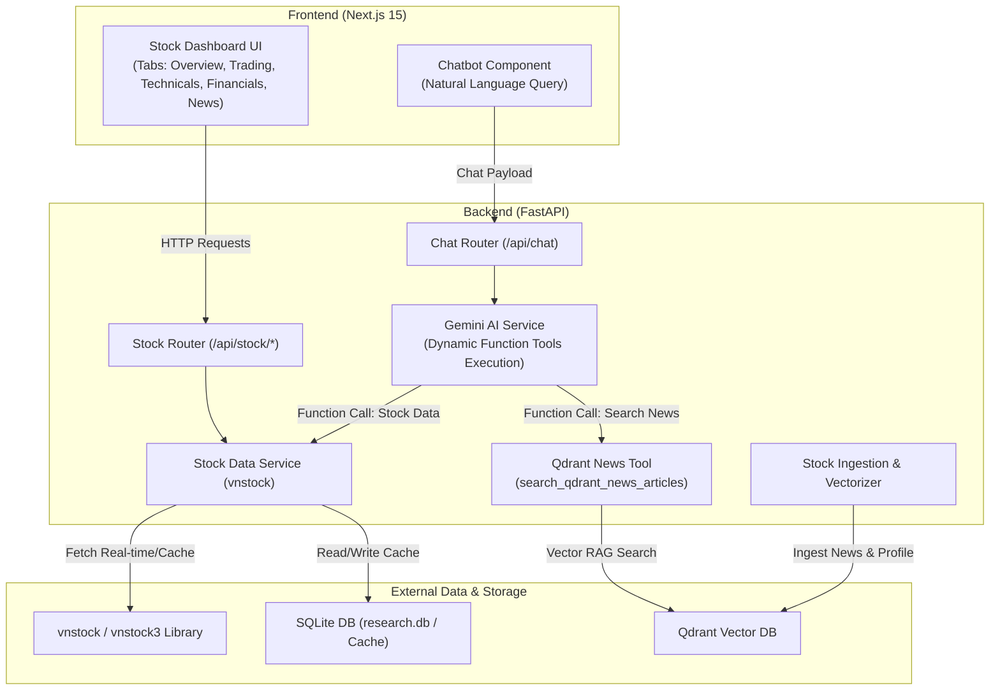

# Thiết Kế Kiến Trúc & Kế Hoạch Triển Khai: Tính Năng Dữ Liệu Chứng Khoán Doanh Nghiệp

---

## 1. Tổng Quan Kế Hoạch

Dựa trên quá trình trao đổi và trao đổi thiết kế, hệ thống sẽ được bổ sung module **Dữ liệu Chứng khoán Doanh nghiệp (Stock Intelligence Module)** với các đặc điểm chính:

- **Nguồn dữ liệu**: Thư viện Python `vnstock` / `vnstock3` tích hợp các API tài chính uy tín (TCBS, SSI, Vietstock, CafeF).
- **Kiến trúc Hybrid**:
  - **Relational / Cache Store (SQLite / In-Memory)**: Lưu trữ và caching dữ liệu chỉ số số học, lịch sử giá, báo cáo tài chính.
  - **Vector Store (Qdrant)**: Embed & lưu trữ tin tức, sự kiện, tổng quan doanh nghiệp phục vụ RAG cho Gemini Agent.
- **Dual Integration (Tích hợp kép)**:
  - **Stock Dashboard UI (Next.js)**: Giao diện bảng biểu trực quan với các tab *Tổng quan*, *Giao dịch*, *Kỹ thuật*, *Tài chính*, *Tin tức & Sự kiện* (thiết kế chuẩn theo mẫu screenshot).
  - **AI Agent Tools (FastAPI & Gemini)**: Cung cấp bộ Function Tools cho Gemini Chatbot tự động tra cứu, trích xuất và phân tích cổ phiếu qua câu lệnh tự nhiên.
  - **Refactor Qdrant News Retrieval**: Bỏ chế độ tự động cào/truy vấn tin tức Qdrant mặc định trong mọi message chat (`/api/chat`). Thay vào đó, chuyển truy vấn Qdrant thành một **Function Tool** (`search_qdrant_news_articles`) để AI Agent tự quyết định khi nào cần tra cứu tin tức.

---

## 2. Sơ Đồ Kiến Trúc (Architecture Diagram)

---

## 3. Danh Sách Các Tab & Dữ Liệu Chi Tiết

| STT | Tab / Nhóm dữ liệu | Loại dữ liệu | Mô tả chi tiết |
|---|---|---|---|
| 1 | **Tổng quan** | Cấu trúc & Text | Ngành nghề, Vốn hóa, P/E, P/S, P/B, EPS, Beta, Giá hiện tại, Biến động, Tóm tắt doanh nghiệp |
| 2 | **Giao dịch** | Số học / Chuỗi thời gian | Giá mở/đóng/cao/thấp, Khối lượng giao dịch, Khối lượng nước ngoài mua/bán |
| 3 | **Kỹ thuật** | Chỉ số kỹ thuật | Các đường MA (SMA20, SMA50, SMA200), RSI, MACD, Bollinger Bands |
| 4 | **Tài chính** | Bảng biểu tài chính | Báo cáo kết quả kinh doanh (KQKD), Cân đối kế toán (CĐKT), Luyện chuyển tiền tệ (LCTT), Chỉ số tài chính chính |
| 5 | **Tin tức & Sự kiện** | Văn bản / Embeddings | Danh sách tin tức mới nhất, sự kiện trả cổ tức, phát hành cổ phiếu, biến động lãnh đạo |

---

## 4. Các Bước Triển Khai Kỹ Thuật (Implementation Roadmap)

### Bước 1: Setup Backend Dependencies & Stock Data Service
- Cài đặt `vnstock3` (hoặc `vnstock`) trong môi trường Python backend.
- Xây dựng module `src/backend/services/stock_service.py`:
  - Trích xuất thông tin doanh nghiệp, giá cổ phiếu, BCTC, chỉ số kỹ thuật, tin tức.
  - Xử lý cache dữ liệu ngắn hạn (In-Memory/SQLite) giảm thời gian phản hồi.

### Bước 2: Refactor Chat Router & Chuyển Qdrant News Retrieval Thành Tool
- Chỉnh sửa `src/backend/routers/chat.py`: Loại bỏ logic tự động gọi `search_articles` trước mỗi lượt câu hỏi.
- Định nghĩa Tool `search_qdrant_news_articles(query: str, limit: int = 5)` kết nối đến `qdrant_service.py`.

### Bước 3: Tích hợp Gemini Function Calling (AI Agent Tools Set)
- Khai báo và đăng ký bộ Function Tools cho Gemini Agent:
  - `search_qdrant_news_articles(query: str, limit: int)`: Tìm kiếm tin tức tổng hợp trong Qdrant Vector DB.
  - `get_stock_overview(symbol: str)`: Lấy thông tin tổng quan doanh nghiệp niêm yết.
  - `get_stock_trading_history(symbol: str, timeframe: str)`: Lấy dữ liệu giá và giao dịch lịch sử.
  - `get_financial_report(symbol: str, report_type: str, period: str)`: Lấy báo cáo tài chính (KQKD, CĐKT, LCTT).
  - `get_stock_news(symbol: str, limit: int)`: Lấy tin tức doanh nghiệp từ vnstock.
- Cập nhật `gemini_service.py` để xử lý vòng lặp gọi Tool (Function Execution Loop) tự động.

### Bước 4: Đưa Dữ Liệu Tin Tức & Tổng Quan vào Qdrant Vector DB
- Bổ sung pipeline vectorize dữ liệu tin tức chứng khoán và thông tin doanh nghiệp vào Qdrant collection `stock_knowledge`.

### Bước 5: Xây Dựng API Endpoints cho Stock Dashboard
- Tạo `src/backend/routers/stock.py`:
  - `GET /api/stock/{symbol}/overview`
  - `GET /api/stock/{symbol}/trading`
  - `GET /api/stock/{symbol}/technicals`
  - `GET /api/stock/{symbol}/financials`
  - `GET /api/stock/{symbol}/news`

### Bước 6: Xây Dựng Giao Diện Stock Dashboard UI (Next.js)
- Thiết kế giao diện Dashboard chuẩn theo mẫu ảnh thiết kế:
  - Header thông tin mã chứng khoán (VNM, HOSE, Giá, % Tăng/Giảm, Vốn hóa, P/E...).
  - Thanh tab điều hướng (Tổng quan, Giao dịch, Kỹ thuật, Tài chính, Tin tức).
  - Tích hợp biểu đồ tương tác (Chart.js / Recharts / Lightweight Charts) cho biến động giá & kỹ thuật.
  - Các card chỉ số tài chính & danh sách tin tức.

---

## 5. Kết Luận & Bước Tiếp Theo

Kế hoạch đã được cập nhật bổ sung phần **Refactor Qdrant News thành Tool**. Bạn có thể phê duyệt kế hoạch trên để bắt đầu tiến hành triển khai mã nguồn cho các thành phần Backend Service & Frontend Stock Dashboard UI!

