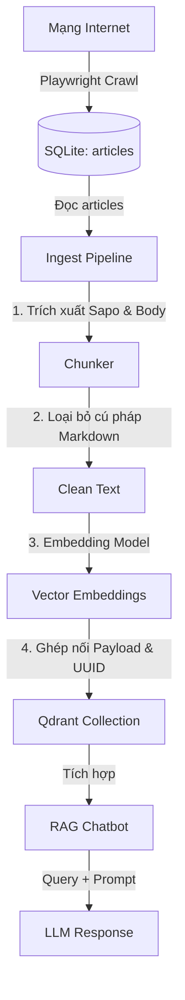
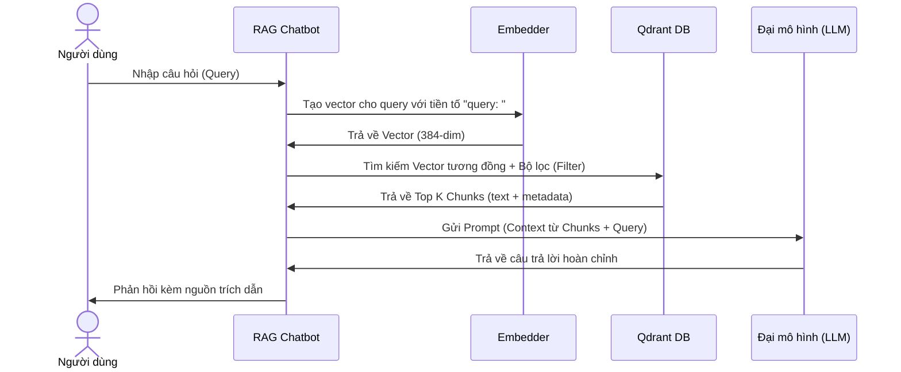

# Cấu trúc Ingest Qdrant & Tích hợp RAG Chatbot

Tài liệu này mô tả chi tiết kiến trúc dữ liệu, luồng xử lý (ingest pipeline) từ cơ sở dữ liệu SQLite vào Vector Database Qdrant, và cách tích hợp dữ liệu này vào hệ thống **RAG Chatbot** (Retrieval-Augmented Generation).

---

## 1. Luồng dữ liệu tổng quan (Data Pipeline)

Hệ thống crawl tin tức sử dụng Playwright để lấy dữ liệu về SQLite, sau đó thực hiện phân mảnh (chunking), tạo vector embedding và đẩy lên Qdrant phục vụ tìm kiếm ngữ nghĩa.



---

## 2. Dữ liệu nguồn (SQLite Source)

Dữ liệu đầu vào cho quá trình Ingestion được lấy từ bảng `articles` của SQLite:

- Bảng: `articles`
- Các trường quan trọng:
  - `url` (TEXT, UNIQUE): Đường dẫn bài viết.
  - `url_hash` (TEXT, UNIQUE): Mã băm SHA-256 của URL, dùng để đối chiếu.
  - `title` (TEXT): Tiêu đề bài viết.
  - `sapo` (TEXT): Đoạn tóm tắt mở đầu bài viết.
  - `content` (TEXT): Nội dung chi tiết dưới dạng Markdown.
  - `site` (TEXT): Tên trang web (ví dụ: `cafef`).
  - `category` (TEXT): Danh mục tin tức.
  - `published_at` (TEXT): Thời gian xuất bản.
  - `author` (TEXT): Tác giả.
  - `tags` (TEXT): Danh sách từ khóa ngăn cách bởi dấu phẩy.

---

## 3. Cấu hình Qdrant Collection

- **Tên Collection**: Cấu hình qua biến môi trường `QDRANT_COLLECTION` (Mặc định: `articles`).
- **Embedding Model**: `intfloat/multilingual-e5-small` (Model đa ngôn ngữ, tối ưu cho tiếng Việt).
- **Kích thước Vector (Vector Dimension)**: `384` chiều.
- **Metric đo khoảng cách (Distance Metric)**: `Cosine` (tương đồng Cosine).
- **Yêu cầu đặc biệt của E5 Model**:
  - Khi **ingest** (lưu tài liệu): Cần thêm tiền tố `passage: ` vào trước đoạn văn bản sạch (được xử lý tự động trong `src/embedder.py`).
  - Khi **retrieval** (chatbot tìm kiếm): Cần thêm tiền tố `query: ` vào trước câu hỏi của người dùng.

---

## 4. Chiến lược phân mảnh (Chunking Strategy)

Để đảm bảo hiệu quả tìm kiếm ngữ nghĩa và giới hạn ngữ cảnh của LLM, mỗi bài viết được chia thành nhiều mảnh (chunk):

1. **Sapo Chunk (`chunk_type = "sapo"`)**:
   - Luôn là chunk đầu tiên của bài viết (chỉ số `chunk_index = 0`).
   - Lấy trực tiếp từ trường `sapo` của bài viết.
2. **Body Chunks (`chunk_type = "body"`)**:
   - Được phân tách từ trường `content` dựa trên cấu trúc tiêu đề Markdown (headings `##`, `###`, tiêu đề in đậm `#### **text**` hoặc các dòng in đậm độc lập).
   - Nếu một phần nội dung vượt quá kích thước `chunk_size` (cấu hình trong `.env`, mặc định `600` ký tự), nó sẽ được chia nhỏ hơn theo đoạn văn (`\n\n`).
   - Có cơ chế đè gối chồng lấn `chunk_overlap` (mặc định `60` ký tự) giữa các chunk liền kề để không làm mất ngữ cảnh ở ranh giới phân mảnh.

> [!NOTE]
> Trước khi tạo Vector Embedding, các cú pháp Markdown (như `#`, `**`, `` ` ``) sẽ bị loại bỏ thông qua hàm `strip_markdown` nhằm tránh làm nhiễu mô hình embedding, nhưng đoạn văn bản gốc chứa Markdown vẫn được lưu trữ đầy đủ trong payload để hiển thị cho Chatbot.

---

## 5. Cấu trúc Point & Payload trong Qdrant

Mỗi chunk được tải lên Qdrant dưới dạng một **Point** với cấu trúc sau:

### Ký tự nhận diện duy nhất (Point ID)
Được tạo tự động theo cơ chế **deterministic UUID** (UUID phiên bản MD5 từ chuỗi `{url_hash}_{chunk_index}`).
- *Ý nghĩa*: Giúp quá trình cập nhật (upsert) có tính **idempotent** (chạy lại pipeline nhiều lần không sợ bị trùng lặp dữ liệu, dữ liệu cũ sẽ tự động ghi đè).

### Payload Schema (Siêu dữ liệu)

Mỗi Point trong Qdrant chứa payload (metadata) chi tiết phục vụ cho việc lọc (filtering) và hiển thị trích dẫn:

| Tên trường | Kiểu dữ liệu | Mô tả |
| :--- | :--- | :--- |
| `article_url` | `string` | URL gốc của bài viết |
| `article_title` | `string` | Tiêu đề bài viết |
| `site` | `string` | Nguồn trang web (ví dụ: `cafef`) |
| `category` | `string` | Danh mục bài viết |
| `published_at` | `string` | Ngày đăng bài (được chuẩn hóa về dạng `YYYY-MM-DD`) |
| `author` | `string` | Tác giả bài viết |
| `tags` | `array[string]` | Danh sách thẻ từ khóa |
| `chunk_index` | `integer` | Thứ tự phân mảnh của bài viết (bắt đầu từ 0) |
| `chunk_type` | `string` | Phân loại mảnh: `"sapo"` hoặc `"body"` |
| `text` | `string` | Nội dung văn bản thô (còn giữ Markdown) của chunk này |
| `url_hash` | `string` | Mã hash SHA-256 của URL bài viết |
| `is_featured` | `boolean` | Bài viết nổi bật (mặc định: `false`) |

---

## 6. Thiết kế tích hợp RAG Chatbot

Để tích hợp Qdrant vào RAG Chatbot, luồng xử lý truy vấn từ người dùng thực hiện theo các bước:



### Bước 1: Chuẩn hóa câu hỏi & Tạo Embedding
Khi người dùng đặt câu hỏi, chatbot phải chuyển câu hỏi thành vector bằng cùng model `multilingual-e5-small`:
```python
# CHÚ Ý: Phải thêm tiền tố "query: " trước khi embed câu hỏi
query_text = "query: Giá vàng hôm nay tăng hay giảm trên CafeF?"
query_vector = embedder.embed(query_text)
```

### Bước 2: Truy vấn Qdrant kèm Bộ lọc (Filtering)
Qdrant hỗ trợ lọc metadata rất mạnh mẽ. Ví dụ, tìm kiếm tin tức liên quan đến câu hỏi nhưng chỉ giới hạn trong trang `cafef` đăng trong vòng 7 ngày qua:

```python
from qdrant_client import QdrantClient
from qdrant_client.models import Filter, FieldCondition, MatchValue

client = QdrantClient(url="http://localhost:6333")

# Thực hiện vector search kèm bộ lọc metadata
search_result = client.search(
    collection_name="articles",
    query_vector=query_vector,
    query_filter=Filter(
        must=[
            FieldCondition(
                key="site",
                match=MatchValue(value="cafef")
            ),
            # Có thể lọc theo khoảng thời gian bằng Range filter nếu cần
        ]
    ),
    limit=5, # Lấy top 5 chunk liên quan nhất
    with_payload=True
)
```

### Bước 3: Xây dựng Prompt cho LLM (Context Assembly)
Sau khi nhận được các chunk kết quả từ Qdrant, kết hợp nội dung `text` của chúng vào Prompt gửi LLM:

**Prompt Template gợi ý:**
```text
Bạn là một trợ lý ảo thông minh của hệ thống RAG Chatbot. Hãy trả lời câu hỏi của người dùng dựa vào ngữ cảnh (Context) được cung cấp dưới đây. Nếu thông tin không có trong ngữ cảnh, hãy nói "Tôi không tìm thấy thông tin này trong nguồn dữ liệu". Hãy trích dẫn nguồn (tiêu đề, URL bài viết) rõ ràng khi trả lời.

---
NGỮ CẢNH:

[Tài liệu {{ loop.index }}]
Tiêu đề: {{ chunk.payload.article_title }}
Nguồn: {{ chunk.payload.site }} | Ngày đăng: {{ chunk.payload.published_at }}
Nội dung: {{ chunk.payload.text }}
URL: {{ chunk.payload.article_url }}
---


CÂU HỎI CỦA NGƯỜI DÙNG:
{{ user_query }}

CÂU TRẢ LỜI CỦA BẠN:
```

---

## 7. Hướng dẫn chạy Ingest pipeline

Để nạp dữ liệu từ SQLite sang Qdrant bằng CLI đã được xây dựng sẵn trong dự án:

1. **Kiểm tra file cấu hình `.env`**:
   Đảm bảo các biến sau đã được thiết lập chính xác:
   ```env
   QDRANT_URL=http://localhost:6333
   QDRANT_API_KEY=your-api-key-if-any
   QDRANT_COLLECTION=articles
   EMBED_MODEL=intfloat/multilingual-e5-small
   CHUNK_SIZE=600
   CHUNK_OVERLAP=60
   ```

2. **Chạy lệnh ingest toàn bộ dữ liệu**:
   ```bash
   uv run main.py ingest
   ```

3. **Chạy ingest lọc theo site hoặc số ngày gần đây**:
   ```bash
   # Chỉ ingest các bài viết crawl trong vòng 7 ngày gần đây từ trang cafef
   uv run main.py ingest --site cafef --since-days 7
   ```

4. **Chạy thử nghiệm không ghi đè (Dry run)**:
   Để kiểm tra số lượng chunk sẽ được tạo ra mà không thực hiện ghi dữ liệu vào Qdrant:
   ```bash
   uv run main.py ingest --dry-run
   ```
